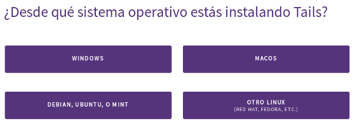
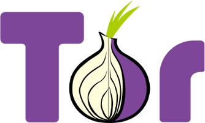
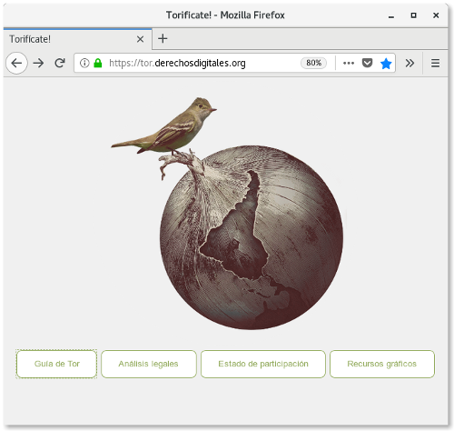
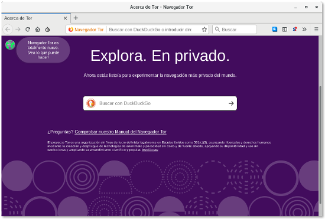
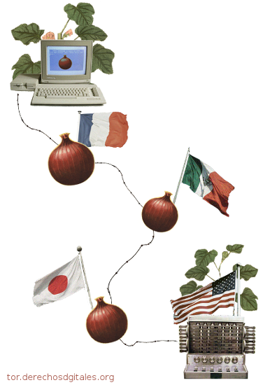
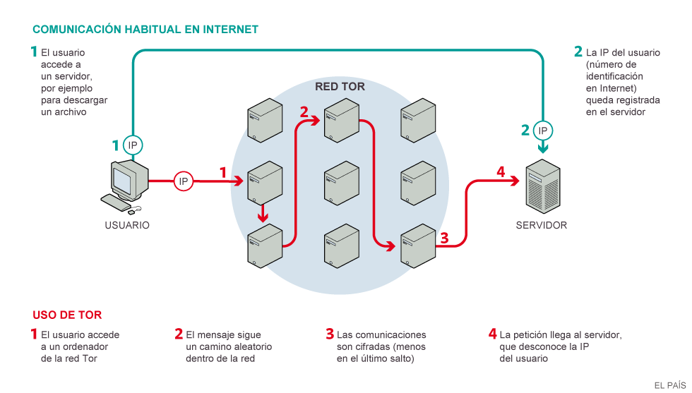
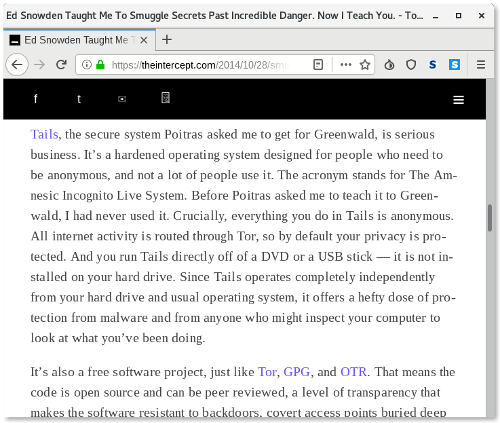

### Un sistema operativo vivo

* funciona en (prácticamente) cualquier computadora
* arranca desde un disco duro, una memoria USB o tarjeta SD

#### Preservando la privacidad y el anonimato

* Usa el internet de manera anónima y evade la censura:
  todas las conexiones a internet son forzadas a salir a tráves de la red Tor.
* No deja rastros en la computadora que estas usando a menos que explicitamente lo pidas.
* Usa herramientas de **software libre** para cifrado de tus archivos, correo y mensajería instantánea.

### Anonimato online y elusión de censura

Tails se basa en la red de anonimato de **Tor** para proteger tu privacidad en línea:

todo el software está configurado para conectarse a Internet a través de **Tor**, si una aplicación intenta conectarse directamente con el Internet, la conexión es bloqueada automáticamente por seguridad.

#### ¿Que es Tor?  

**Tor** es una de las tecnologías más efectivas para proteger tu privacidad en linea y garantizar que tu seguridad en linea
personal permanece bajo tu control

[www.torproject.org](https://www.torproject.org/)

#### ¿Que es Tor?

[tor.derechosdigitales.org](https://tor.derechosdigitales.org/)

#### ¿Que es el proyecto Tor?

<small>Es una organización sin fines de lucro con sede en los Estados Unidos de América y cuyo nombre oficial es Tor Project Inc.</small>

#### ¿Que es la red Tor?

<small> Es una red de computadoras distribuidas alrededor del mundo, mantenida por miles de personas voluntarias. Cada computadora es llamada nodo (relay en inglés).</small>

#### Navegador tor

<small>Es un navegador web basado en Firefox que incluye el software tor y viene configurado para conectarse como cliente de la red Tor. Es la manera más sencilla de conectarte a la red y es lo que la mayoría de las personas usan para navegar de manera anónima o visitar sitios exclusivos de la red Tor, usando los llamados servicios onion.</small>

#### ¿Que es Tor?

* Su proveedor de servicios de Internet (ISP), y cualquiera que esté observando su conexión localmente, no podrá rastrear su actividad en Internet, incluyendo los nombres y direcciones de los sitios web que visite.

* Los operadores de los sitios web y servicios que use, y cualquiera que los esté observando, verán una conexión proveniente de la red Tor en lugar de su dirección de Internet (IP) real, y no sabrán quién es usted a menos que usted se identifique de forma concreta.

### ¿Que es Tor?

Tor te protege redirigiendo tus comunicaciones alrededor de una red distribuida de relays realizados por voluntarios alrededor del mundo: lo cual previene que alguien observe tus comunicaciones a partir de los sitios que visitas, también  evita que los sitios que navegas obtengan tu ubicación física."

#### ¿Que es Tor?

#### ¿Que es Tor?

### Otras caracteristicas

* Existe desde el 2009 (ya 10 años)
* Traducido en muchos idiomas (ES, FR, IT, ENG, FA, DE. PT)
* Software libre, desarrollo abierto y publico:  
* Documentación del diseño
* Transparencia

Y... ¿funciona?

#### de acuerdo a la NSA, si :  

<small>[https://theintercept.com/2014/10/28/smuggling-snowden-secrets](https://theintercept.com/2014/10/28/smuggling-snowden-secrets/)<small>

### En cualquier lugar

Usar **Tails** en una computadora no lo altera, ni depende del sistema operativo instalado. Así que puedes usarlo en tu computadora, en la de un@ amig@, o una en tu biblioteca local.

Después de apagar Tails, la computadora iniciará de nuevo con su sistema operativo habitual."

### Amnésico

**Tails** está configurado con especial cuidado de no usar los discos duros de la computadora, incluso si hay espacio intercambiado en ellos. El único espacio de almacenamiento usado por **Tails** está en la memoria RAM, que se borra automáticamente cuando se apaga la computadora.

Así que no dejarás ningún rastro en la computadora del sistema Tails en sí, ni de para qué lo usaste. Es por eso que llamamos a Tails **amnésico**

### Amnésico

Esto te permite trabajar con **documentos sensibles** en **cualquier** computadora, y te protege de la recuperación de información después de apagar. Claro, aun así puedes guardar de forma explícita documentos específicos en otra USB, o en un disco duro extraíble y sacarlos para un uso futuro.

Tails además contiene una selección de herramientas para proteger tus datos usando criptografía fuerte.

## Nuestra hipotesis

A menudo la usabilidad importa mas que "solamente" la seguridad.

Hacer una "linea de base" del nivel de seguridad (privacidad, anonimato) muy accesible.  

⇒ Tails es ampliamente usado  
⇒ Enfocado en poder dar mantenimiento, continuidad.
⇒ Energía ↗ para incrementar la seguridad sin disminuir la usabilidad.

## Ejemplos de aportes "upstream"

* AppArmor
* libvirt
* Seahorse
* Debian
* Debian Live
* fix OTR downgrade → v1

### Tails te necesita, para...

### Traducción

Las personas traductoras permiten que mas personas alrededor del mundo usen Tails.

[tails.boum.org/contribute/how/translate](https://tails.net/contribute/how/translate/)

Lista de correo traductores:
[mailman.boum.org/listinfo/tails-l10n](https://mailman.boum.org/listinfo/tails-l10n)

Lista de correo traductores en español:
[mailman.boum.org/listinfo/tails-l10n-spanish](https://mailman.boum.org/listinfo/tails-l10n-spanish)

### Documentación

Las personas que contribuyen pueden hacer que Tails sea accesible a más personas.

<https://tails.net/contribute/how/documentation/>

### Tests

Las personas que prueban versiónes beta ayudan a mejorar la calidad de Tails.

<https://tails.net/contribute/how/testing/>

## Diseño

Les diseñadores web y gráficos pueden hacer que Tails sea más fácil de usar y más atractivo.

<https://tails.net/contribute/how/website/>

<https://tails.net/contribute/how/graphics/>

## Usabiidad

<https://tails.net/contribute/how/user_interface/>

## Debian

Se puede mejorar Tails (y otros derivados de Debian contribuyendo a Debian).

<https://tails.net/contribute/how/debian/>

* AppArmor (<https://wiki.debian.org/AppArmor/Contribute>)
* &#35;6507: Package our OpenPGP applet for Debian
* &#35;7352: Backport ruby-libvirt 0.5+ for Wheezy

### Donar  

<https://tails.boum.org/contribute/how/donate/>

### Habla con nosotras

* Development mailing-list: **<tails-dev@boum.org>**
* Mailing-list for translators: **<tails-l10n@boum.org>**
* Early testers mailing-list: **<tails-testers@boum.org>**
* Private and encrypted mailing-list: **<tails@boum.org>**
* IRC: see <https://tails.boum.org/contribute/>
* Web: **<https://tails.boum.org/>**

### Fuente

comparte, reutiliza, remixea esta presentación

codigo fuente:https://0xacab.org/carlosm2/tails-reveal

### Licencia de producción de pares:

https://endefensadelsl.org/ppl_deed_es.html

### onion - cebolla

<small>http://dwtxl2f7x64kp4zhcrhcebixtwb25s446pvmxgnqdjrmzeelgwyha5yd.onion:8081/tails/</small>

### Creditos

Basado en la presentación de intrigueri:

https://tails.boum.org/contribute/how/promote/material/slides/Roma-Uni_Sapienza-20150127/Tails/

La mayor parte de las ilustraciones son de la página de https://tails.net y de https://tor.derechosdigitales.org/

carlosm2@riseup.net / carlos@tierracomun.org / carlosm@mail.mayfirst.org
